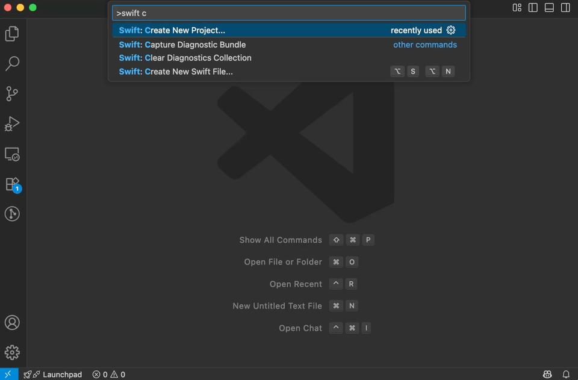

# Create a New Swift Project

There are several project templates to choose from:
- `Library`: A package with a library. Use this to publish code for other packages to consume.
- `Executable`: A package with an executable. Use this for command line utilities.
- `Tool`: A package with an executable that uses Swift Argument Parser. Use this if you plan to have a rich set of command line arguments.
- `Build Tool Plugin`: A package that vents a Swift build tool plugin.
- `Command Plugin`: A package that vends a Swift command plugin.
- `Macro`: A package that vends a Swift macro.
- `Empty`: An empty package with just a `Package.swift` manifest.

Once you select a template, you'll be prompted to enter a name for your new project. This will be the name of the folder created in your workspace.

Finally, you'll be prompted to select a location for your new project. You can choose any location in your workspace, or create a new folder.

# Opening Existing Projects

When you open an existing project with a ``Package.swift`` file the extension will start automatically.

Tip: You can view more information about the toolchain and other configurations being used for the project by hovering over the `{}` icon in the bottom right corner of the status bar.

